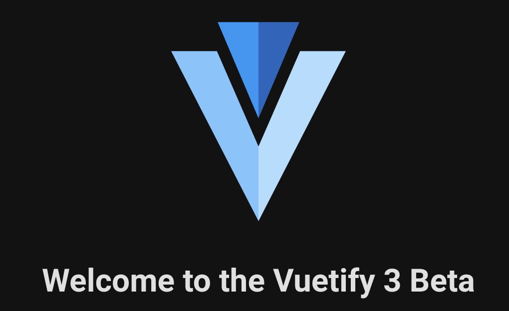

# A Dark Launch with a Vue


maybe an intro post, not building, just introduction to that we have a Vue SDK

- installing the SDK
- a tiny amount of sample code, snippets
- links to the docs

this could be a follow on to that post


If you're building a modern web application there is a huge field of candidates for your runtime, your build, and your hosting.

Vue can be an excellent choice for a number of reasons.

1. Popularity - the more mainstream a tool, the easier it is to recruit, retain, and find support.

   [https://next.vuetifyjs.com/en/introduction/why-vuetify/]:

   > Since its initial release in 2014, [Vue.js](https://vuejs.org/) has grown to be one of the most popular JavaScript frameworks in the world. One of the reasons for this popularity is the wide use of components which enable developers to create concise modules to be used and re-used throughout their application. UI libraries are collections of these modules that implement a specific style guideline and provide the necessary tools to build expansive web applications.

2. Speed - Fast is first.

   [https://vuejs.org/about/faq.html#is-vue-fast]:

   > In stress-testing scenarios, Vue out-performs React and Angular by a decent margin in the [js-framework-benchmark](https://rawgit.com/krausest/js-framework-benchmark/master/webdriver-ts-results/table.html). It also goes neck-and-neck against some of the fastest production-level non-Virtual-DOM frameworks in the benchmark.

3. Scalability & Composability - the best things grow bigger over time, you will need to scale.

   [https://vuejs.org/about/faq.html#does-vue-scale]:

   > - [Single-File Components](https://vuejs.org/guide/scaling-up/sfc.html) provide a modularized development model that allows different parts of an application to be developed in isolation.
   > - [Composition API](https://vuejs.org/guide/reusability/composables.html) provides first-class TypeScript integration and enables clean patterns for organizing, extracting and reusing complex logic.
   > - [Comprehensive tooling support](https://vuejs.org/guide/scaling-up/tooling.html) ensures a smooth development experience as the application grows.

Additionally, finding ways to focus more of your energy on what you **need** to build and less energy on non-differentiating things is more important than ever as the appetite for software solutions to so many problems grow.

As we ship faster, we haven't lost the need to ship safe, and as the next evolution in software delivery, feature flagging is the missing link in enabling the fastest, safest, and best way to learn from your delivery and your users.

In this post, we're going to lay out how to launch a new Vue app, mixin just the right amount of tools that make life so much easier, and wire in feature flagging with LaunchDarkly so we can ship changes faster and safer than ever.


## The setup

This is a highly opinionated toolset because highly opinionated toolsets tend to offer the most acceleration when you stay within their bounds, so this is exactly what we're going to do!

### 1. It's got to be Veautiful

UI Component libraries are a great way to turbo charge your delivery, keep things beautiful, and reduce your decision fatigue.

Whether you have a great eye for design or you prefer to offload that work, a UI component library is a super foundation to build from as they're often founded in a design system which has guidance on how to consistenly communicate an experience to your users.

At the time of this writing, the list of UI component libraries supporting Vue 3 is not long, but there are some candidates. Ideally, we want something that integrates easily with our builder and bundler, something that offers lots of helpers, and something that mostly gets out of our way and just makes things beautiful. 

Enter [Veautify](https://next.vuetifyjs.com/en/).

> [https://next.vuetifyjs.com/en/introduction/why-vuetify/#what-is-vuetify3f]:
>
> Vuetify is a complete UI framework built on top of Vue.js. The goal of the project is to provide developers with the tools they need to build rich and engaging user experiences. Vuetify is designed from the ground up to be easy to learn and rewarding to master with almost a hundred carefully crafted components from the [Material Design specification](https://material.io/)


### 2. It's got to be Velocious

Building and Bundling web applications is complicated. You're trying to achieve the smallest bundle size so your app loads quickly for your user and you'd love to not have to worry so much about bundling, it would be nice if you didn't have to master bundling and building just to get your app out the door.

[Webpack](https://webpack.js.org/) has been around for a long time, is incredibly popular, offers an amazing amount of customization, and loads of examples and info out there. It can be a bear to get right and there is a lot to learn. [NPM](https://www.npmjs.com/package/webpack) boasts an impressive 24 million downloads a week. A challenge many face with Webpack is the complexity of configuration and slow build speed, which hampers development time.

[Parcel](https://parceljs.org/) is another entry in the bundling space which boasts `zero-config` and 10-20X faster build times than Javascript based tooling as it's written in Rust, but is far less popular based on [NPM stats](https://www.npmjs.com/package/parcel) with about 100k weekly downloads.

[Vite](https://vitejs.dev/) seeks to solve the pain of slow building and bundling at development time and be a first-class choice in bundling and building and it delivers. While it's much younger than it's counterparts, it appears to be gaining massive popularity, with about [1.5 million weekly downloads](https://www.npmjs.com/package/vite), and for good reason. It is lightning fast and ridiculously easy to use.

For this project we'll use Vite because [it easily integrates with Vue and Vuetify](https://next.vuetifyjs.com/en/getting-started/installation/#vite), plus it's as fast as greased lightning.

### 3. It's got to be (V)easy

While we can run locally, running locally always feels a little like playtime because you run into the "it works on my machine" problem. It's hard to show others because your friends, family, and co-worker can't get to your http://localhost:8080 link for some reason.

Netlify makes an astoundingly easy platform on which to run, but you have to be comfortable with the idea of a pipeline and there is some delay in the feedback loop and some complication in getting it all right. For this endeavor, we'll skip Netlify and pick another way to run that reduces the opportunities for hiccups in our delivery.

Replit is an amazing option for running an app you can share with others, develop on, and rapidly iterate, live. 
In this project, we're going to include the necessary files to make a Repl and an ultra quick run through of how to get live in Replit with this project so you can share this with friends!


## LFG!

### Prerequisites

- Node.js 16+
- NPM 7+
- [Vue CLI](https://cli.vuejs.org/guide/installation.html)
- A little comfort with the command line

#### Three simple steps:

1. Create the app
   ```shell
   # https://next.vuetifyjs.com/en/getting-started/installation/#vite
   # npm 7+, extra double-dash is needed:
   npm create vite@latest dark-launch-with-a-vue -- --template vue
   ```

2. Install Vuetify
   ```shell
   cd dark-launch-with-a-vue
   vue add vuetify
   # select Vite Preview (Vuetify 3 + Vite) when prompted
   ```

3. Install LaunchDarkly SDK
   ```shell
   npm install launchdarkly-vue-client-sdk
   ```

    <small>:warning:if you run into any issues here, just delete your node_modules folder and try again.</small>

### Wherever we go, we are running!

Start your app and everything we do from here will be hot reloaded as we build.

```shell
npm run dev
```

You should now have this running at http://localhost:3000. 
It doesn't really look anything like we want, but it's a start and it's working.


### New App Who This?

We've installed LaunchDarkly, but Vue doesn't know about it. We need to connect them, so we're going to change `src/main.js` to wire things together. (copy and paste the code below and replace the starter code in `main.js`)

```javascript
import { createApp } from 'vue'
import App from './App.vue'
import vuetify from './plugins/vuetify'
import { loadFonts } from './plugins/webfontloader'
import { LDPlugin } from 'launchdarkly-vue-client-sdk'

const app = createApp(App);

// Vite puts the environment variables in this variable and to prevent leaking of environment variables not
// meant for the client, they have to be prefixed with VITE 
// or else Vite wouldn't add them to it's environment #yoursecretissafewithvite
if (import.meta.env.VITE_CLIENT_ID) {
  
  // we're telling the LaunchDarkly SDK the client ID with which it should retrieve flags
  const clientSideID = import.meta.env.VITE_CLIENT_ID;
  
  // this didn't have to be a named variable, but I wanted to be extra clear about what I was doing here
  // here are the docs about the plugin options: 
  // https://launchdarkly.github.io/vue-client-sdk/index.html#LDPluginOptions
  const launchDarklyPluginOptions = { 
    clientSideID,
    //user, // our user is anonymoust (by default) but you can read more about user here
  };
  
  app.use(LDPlugin, launchDarklyPluginOptions)
}

loadFonts()

app.use(vuetify)
app.mount('#app')
```

Nothing has changed yet. Note the conditional check for the environment variable.

<details><summary>Let's get your client ID from LaunchDarkly</summary>

  Get your LaunchDarkly Client-Side ID from the [LaunchDarkly console](https://app.launchdarkly.com/)

   - :sunglasses:  Super cool way
     - `CMD+K` or `CTRL+K`, typing "copy" and selecting `Copy SDK key for the current environment` and selecting **"Client-side ID"** from the list. 
        <details><summary>Click here to see how</summary>

          
        </details>

   - :hand: Manual way 
      - You can find the Client-Side ID under `Account Settings > Projects > <Your Project Name>`
      - Click your project name
      - Click the `Client-side ID` for the key you want
        (This will add it to your clipboard for easy copy and paste.)

**:warning: Potential gotcha**: 
    make sure you got the **"Client-side ID"** from the LaunchDarkly console and not one of the other keys! 
</details>

We add it to the app with just a few keystrokes

```shell
# back in your terminal, in the dark-launch-with-a-vue directory

# this will make the terminal wait for your client ID to be pasted 
read client_id

# paste your client ID into the terminal and hit enter

# this will write your client ID to your .env file, which is ignored by the .gitignore
echo "VITE_CLIENT_ID=$client_id" > .env  

# let's make sure your .env isn't committed in git so we don't accidentally share your client ID in your repo
echo ".env" >> .gitignore
```


### Let's Go Launching in the Dark!

First step, let's turn the lights out:

Replace the contents of `src/plugins/vuetify.js` with this code: (copy and paste)

```javascript
// Styles
import '@mdi/font/css/materialdesignicons.css'
import 'vuetify/styles'
import * as components from 'vuetify/components'
import * as directives from 'vuetify/directives'

// Vuetify
import { createVuetify } from 'vuetify'

export default createVuetify({
  // https://vuetifyjs.com/en/introduction/why-vuetify/#feature-guides
  components,
  directives,
  theme: {
    defaultTheme: 'dark',
  }
})
```

Much better!


Let's dark launch a new UI now and see some real feature flagging power from LaunchDarkly.

For starters, we'll add a banner so we can know that LaunchDarkly is working correctly. 
That way we'll have a good litmus test on every page to see that LaunchDarkly is working.

#### We're having a banner moment

Replace the code in `App.vue` in `./src` and fill it in with this:

```vue
<template>
  <v-app>
    <v-app-bar>
      <v-toolbar dark v-if="isLaunchDarklyReady" color="#405BFF">
        <v-toolbar-title align="center">Features Powered by LaunchDarkly</v-toolbar-title>
      </v-toolbar>
    </v-app-bar>
    <v-main>
      <HelloWorld/>
    </v-main>
  </v-app>
</template>

<script setup>
  import { ref } from 'vue';
  import HelloWorld from './components/HelloWorld.vue'
  import { useLDReady } from 'launchdarkly-vue-client-sdk';

  let isLaunchDarklyReady = ref(false);
  try {
    isLaunchDarklyReady = useLDReady();
  } catch (error) {
    console.error('error checking LD Ready', error);
  }
</script>
```

We're using the `v-if` directive from Vue to conditionally render our toolbar only if our `reactive` object `isLaunchDarklyReady` is truthy. We're using [Vue's Composables](https://vuejs.org/guide/reusability/composables.html#what-is-a-composable) pattern to track the state of the LaunchDarkly client.

> In the context of Vue applications, a "composable" is a function that leverages Vue's Composition API to encapsulate and reuse ***\*stateful logic\****.

Our composable, `useLDReady` returns a reactive object so Vue can observe and subscribe to state changes in that object powering the conditional rendering of our banner.

You should now see our "subtle" banner:


Let's prove it works. If we comment out line 25 of `src/main.js` this will remove the LaunchDarkly plugin from Vue.


Perfect! Let's revert the change to `src/main.js` commit our changes because we have a working app and then we'll get to some shipping and flagging.

```shell
# in our project directory
git init
git add .
git commit -m 'nbd, just dark launching a Vue app'

# optional side-quest so you can share with friends and family
# requires github cli
gh repo create
? What would you like to do? Push an existing local repository to GitHub
? Path to local repository .
? Description Dark launch with a Vue using LaunchDarkly Vue SDK, Vite, Vue, and Veautify!
? Visibility Public
✓ Created repository halex5000/dark-launch-with-a-vue on GitHub
? Add a remote? Yes
? What should the new remote be called? origin
```

### Your first Dark Launch

We're going to add a new feature to our app, but this is going to be a real dark launch.
We are going to leverage LaunchDarkly's targeting to target a specific user so only they can see the new feature while we build it out so we don't break things for everyone else.

#### Adding a Login Feature

- As our app evolves, it's going to become stateful, so we're going to need a way to share state between our components without breaking all the rules. A state store which conceals this state will work for our app, but you can read more about state management in Vue [here](https://vuejs.org/guide/scaling-up/state-management.html).
  Create a new file `src/components/store.js`  with the following

  ```javascript
  import { reactive } from 'vue'
  
  export const store = reactive({
    // whether to show the Login drawer
    showLogin: false,
    // the username of the user
    username: 'anonymous',
    // functions to avoid having folks manipulate state globally
    toggleLogin() {
      this.showLogin = !this.showLogin;
    },
    setUsername(username) {
      this.username = username;
    },
  });
  ```

- Add a button to the toolbar to open the login drawer
  ```vue
  <!-- abridged version of App.vue -->
  
  <template>
    <v-app>
      <v-app-bar>
        <v-toolbar dark v-if="isLaunchDarklyReady" color="#405BFF">
          <v-toolbar-title>Features Powered by LaunchDarkly</v-toolbar-title>
          <v-btn @click="store.toggleLogin()">
              <template v-slot:prepend>
                <v-badge
                  color="info"
                  :content="store.username"
                  inline
                >
                </v-badge>
              </template>
              <v-icon>mdi-account</v-icon>
          </v-btn>
        </v-toolbar>
      </v-app-bar>
      <v-main>
        <HelloWorld/>
      </v-main>
    </v-app>
  </template>
  
  <script setup>
    // only showing the new imports
    import { store } from './components/store';
  </script>
  ```
  
  Which adds this to your toolbar:
  
  
- Create a Login Component
  Add a file `Login.vue` to `src/components`

  ```vue
  <script setup>
      import { useLDClient } from "launchdarkly-vue-client-sdk";
      import { store } from './store';
  
      // capture the state in an object so we don't update the actual username until
      // the user clicks login
      const form = {};
  
      // this is how we'll interact with the LaunchDarkly client directly
      // also needs to be in the setup block
      // we'll use this to identify the user once they login
      const client = useLDClient();
  
      // set the username when the user clicks login
      const login = async () => {
          if (form.username) {
              // asks the LaunchDarkly client for the current user info
              const user = client.getUser();
  
              console.log("current user is", client.getUser());
  
              // here's where update the user's identity in the LaunchDarkly client
              await client.identify({
                  // keep anything else we already attributed to the user
                  ...user,
                  anonymous: false,
                  // update the key, the unique identifier for this user
                  // to be their username
                  // we use .value to access the value because as a reactive object
                  // we interact with Vue's proxy for the object
                  // learn more here: https://vuejs.org/guide/essentials/reactivity-fundamentals.html
                  key: form.username,
              });
  
              console.log("current user is", client.getUser());
              store.setUsername(form.username);
              store.toggleLogin();
              form.username = "";
          }
      };
  </script>
  
  <template>
      <v-navigation-drawer v-if="store.showLogin" permanent location="right" width="400">
          <v-card
              height="250"
              width="400"
              color="#282828"
              class="align-center justify-center"
          >
          <v-card-title>Login</v-card-title>
          <v-spacer></v-spacer>
          <v-container>
              <v-row>
              <v-col>
                  <v-card-text>
                  <v-text-field
                      label="Username"
                      required
                      v-model="form.username"
                  ></v-text-field>
                  </v-card-text>
              </v-col>
              </v-row>
          </v-container>
          <v-spacer></v-spacer>
          <v-card-actions>
              <v-btn primary @click="login()">Login</v-btn>
              <v-btn @click="store.toggleLogin()">Cancel</v-btn>
          </v-card-actions>
          </v-card>
      </v-navigation-drawer>
  </template>
  ```
  
  and go back and include your new component in `src/App.vue`
  ```vue
  <!-- abridged version of App.vue -->
  <template>
    <v-app>
      <Login v-if="store.showLogin" />
      <!-- ... the rest of App.vue template hasn't changed. -->
  </template>
  
  <script setup>
    // the rest of the script block hasn't changed, just add this import
  	import Login from './components/Login.vue';
  </script>
  ```
  
  Now you have a working Login, but, **before** we ship this, let's launch it darkly. :rocket:
  


- First, gate the Login feature by using the `v-if` directive from Vue to conditionally render the button we use to open the drawer and use the composable, `useLDFlag` from the LaunchDarkly Vue SDK to hook into state changes in the flag and get a reactive object Vue can use to observe changes.
  

  ```vue
  <template>
  	<!-- stuff before the account button hasn't changed -->
  	<v-btn v-if="isLoginEnabled" @click="store.toggleLogin()">
  	<!-- stuff after  the account button hasn't changed -->
  </template>
  
  <script setup>
    // only showing changes
    import { useLDReady, useLDFlag } from 'launchdarkly-vue-client-sdk';
    // create a reactive variable defaulting to false so in case LaunchDarkly client doesn't initialize
    // we default to showing nothing.
    let isLoginEnabled = ref(false);
    try {
      isLaunchDarklyReady = useLDReady();
      // if useLDReady errors because something is wrong, we just won't get here
      isLoginEnabled = useLDFlag('login', false);
    } catch (error) {
      console.error('error checking LD Ready', error);
    }
  </script>
  ```

  And just like that, your button to show the Login drawer is no longer showing.
  When using `useLDFlag` you can provide a default value, in this case `false` which can be used for type inference in strongly-typed environments. Here, we're providing it so that in the time while we wait to get initial flag values from LaunchDarkly (<200ms) we begin with false and only reveal the feature if we receive an update to that value.

- Create the Login feature in LaunchDarkly
  In the LaunchDarkly console, create a new feature, Login.
  Make sure to check `SDKs using Client-side ID` 

- Enable the feature in LaunchDarkly
  Your Login feature is now enabled for all users. If you find something is amiss with your new feature, it's just as easy to turn it back off without shipping anything, just switch the feature off in LaunchDarkly and your login disappears for all users nearly instantaneously.

- This is great time to commit and push your changes so you can share your learning and have a restore point as a backup plan.
  ```shell
  git add .
  git commit -m 'added the login feature gated behind a LaunchDarkly feature flag'
  git push # if you setup a remote for this repo
  ```

#### Minigame - It's Alive!

<details><summary>expand this to reveal a mini-game and a chance to level up</summary>
  For this minigame, we'll ship this app into Replit so you can see it run in the real world.
  Replit makes it super easy to run in any language with just a little config and if you followed the earlier sidequest of pushing up to Github, we'll just connect Replit to your repo to bring it all together!

  Prerequisite: Create an account in [Replit](https://replit.com/~).

  Step 1: Create Replit config files in the project root directory
  - `replit.nix`
    ```nix
    { pkgs }: {
      deps = [
        pkgs.nodejs-16_x
            pkgs.nodePackages.typescript-language-server
            pkgs.yarn
            pkgs.replitPackages.jest
      ];
    }
    ```
  - `.replit`
    ```
    language="nodejs"
    run = "npm run dev"
    entrypoint = "./README.md"
    ```
  - Update `vite.config.js` to expose your app outside of just localhost so Replit can link to it.
    ```javascript
      // update the config to indicate there's a server
      export default defineConfig({
        server: {
          host: true
        },
      // ... nothing else changed
    ```

  Step 2: Head over to [Replit](https://replit.com/~)
  - Click Create
  - Click the `Import from Github` button
    (you'll have to authorize Replit to access your Github repo)
  - Install packages in the `Shell` tab (after your repl imports)
    ```shell
    npm install
    ```
  - Add a new Secret in Replit
    - Key: VITE_CLIENT_ID
    - Value: `your client id from your .env file`
  - Click `Run` in Replit!
  - Your app is now live on the interwebs!
  - :warning: if you have trouble getting your app running in Replit you may need to update the version for vite and @vitejs/plugin-vue to 3.0.1
</details>


#### A New User Experience

- Next we're going to learn about user targeting so we can roll out our new feature, the new user experience, in an ultra-controlled way. We'll gate our new user experience behind a feature flag so no one will see it until we're ready and we'll decide exactly who can see it when we are.
  (need a link to user targeting)

- Last time, we created the feature, then we gated it, this time, we'll embrace "feature-driven development" and we'll start with the gate, then build out the feature behind the gate.

  Begin by updating `src/App.vue`  with the following:
  ```vue
  <template>
    <v-main>
      <HelloOsmo v-if="isNewExperienceEnabled" />
      <HelloWorld v-else />
    </v-main>
  </template>
  
  <script setup>
  // unchanged lines omitted
  let isNewExperienceEnabled = ref(false);
  try {
  	// unchanged lines omitted
    isNewExperienceEnabled = useLDFlag('new-ui', false);
  </script>
  ```

  We're adding a new component, `HelloOsmo` to our `App.vue`  and we're adding the boolean flags, all the user targeting will happen in LaunchDarkly, so your code doesn't have to worry about **who** should and shouldn't see this, just **whether** they should or not.

- Create a new file `HelloOsmo.vue`  in `src/components` you'll add to this component in just a minute.
  ```vue
  <template>
  
  </template>
  
  <script setup>
  
  </script>
  ```

  

- Create the new-ui feature flag in LaunchDarkly
  So we can really embrace feature-driven development, we'll create our flag in LaunchDarkly now and start using it to manage what we see in our local app while we're developing.

  - In the LaunchDarkly console, create a new feature, Login.
    Make sure to check `SDKs using Client-side ID` 
  - Enable the feature in LaunchDarkly
    Your new user experience feature is now enabled for all users.
    In your local app, you should see a mostly blank screen.
  - Change the `Default Rule` to serve False, so that by default, users will not see this feature.

- Target a user for the feature
  Before we ship this new feature which isn't ready for general consumption we're going to target a user so only that user can see it and we won't ruin the experience for existing users.
  In the LaunchDarkly console, in your `new-ui` feature flag, click on `+ Add user targets` to add a user target.
  

  Type in the username you want to target and press enter.
  Click the Review and Save button at the top of the screen.

- Enable the feature in LaunchDarkly
  Effective immediately, this user can see this feature, and only this user.

- Go back and Login to your app with this username and you'll see your new user experience, which is admittedly underwhelming at the moment.
  If you did the mini game section earlier with Replit, this is a great time to commit, push, and pull into Replit so you can see the changes live!

- Let's fix that!

  - Step 1: Build out Hello Osmo
    Back in `src/components/HelloOsmo.vue` paste in this code.

    ```vue
      <template>
        <v-timeline>
          <v-timeline-item
            v-for="(item, i) in items"
            :key="i"
            :dot-color="item.color"
            :icon="item.icon"
            fill-dot
          >
            <template v-slot:opposite>
              <v-chip class="ma-2" :color="item.color" text-color="white">
                {{ item.subtitle }}
              </v-chip>
            </template>
            <v-card max-width="425" min-width="400" elevated rounded="true">
              <v-card-title
                :color="item.color"
                class="white text--primary text-h5"
                align="center"
              >
                <v-avatar size="150">
                  <v-img v-if="item.image" size="100" :src="item.image"></v-img>
                  <v-icon v-else="item.icon" size="100" :color="dotColor">{{
                    item.icon
                  }}</v-icon>
                </v-avatar>
                <h4>{{ item.title }}</h4>
              </v-card-title>
            </v-card>
          </v-timeline-item>
        </v-timeline>
      </template>
    
      <script setup>
      const items = [
        {
          color: "#405BFF",
          icon: "mdi-trophy",
          title: "Congratulations!",
          subtitle: 'quest completed!',
        },
        {
          color: "#FF386B",
          icon: "mdi-star",
          title: "New user experience enabled!",
          subtitle: 'targeting a user!',
        },
        {
          color: "#A34FDE",
          icon: "mdi-account",
          title: "Login Enabled",
          subtitle: 'targeting enabled!',
        },
        {
          color: "#405BFF",
          icon: "mdi-flag",
          title: "LaunchDarkly",
          image: "./blog-images/osmo.png",
          subtitle: 'powering your features!',
        },
        {
          color: "#FF386B",
          icon: "mdi-vuetify",
          title: "Vuetify",
          image: "./blog-images/logo.svg",
          subtitle: 'keeping it vuetiful!',
        },
        {
          color: "#A34FDE",
          icon: "mdi-vuejs",
          title: "Vue 3",
          image: "./blog-images/vue.png",
          subtitle: 'running your app!',
        },
        {
          color: "#405BFF",
          icon: "mdi-package",
          title: "Vite",
          image: "https://vitejs.dev/logo.svg",
          subtitle: 'bundling and building!',
        },
      ];
      </script>
    ```

    

Congratulations, your Dark Launch with a Vue is complete, but your Dark Launching is only just beginning!
